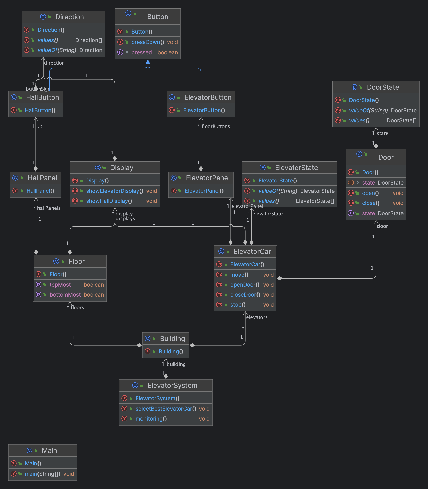

The Strategy design pattern can be applied here since the system could
have multiple dispatch request strategy classes. Therefore, depending on
the particular layout of the building and its scenarios, we choose a set of
dispatch request strategy classes.
We can also use the State and Delegation design pattern for this problem.
Instead of implementing all methods on its own, the context object stores
a reference to one of the state objects that represents its current state and
delegates all the state-specific tasks to that object. For example, elevators
have multiple states like working or idle, etc. Based on the state, the
system infers which method or behavior of the elevator should be
invoked.

